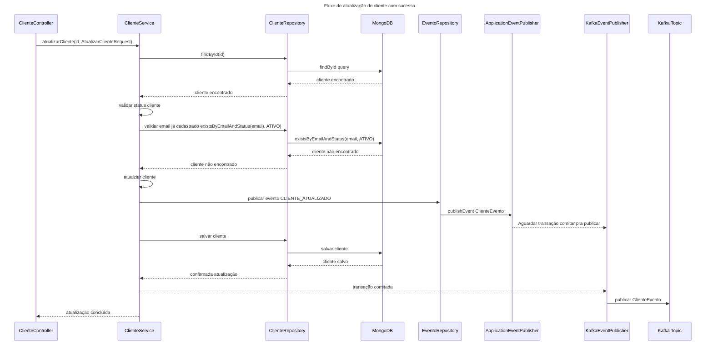
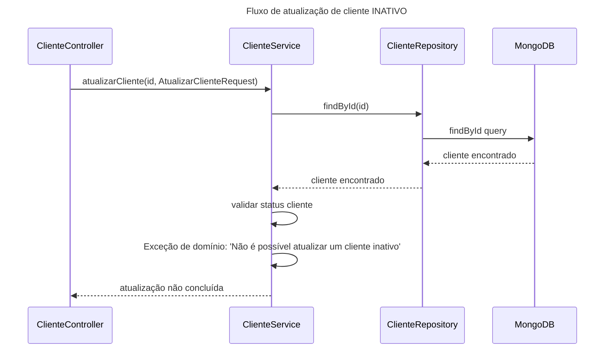
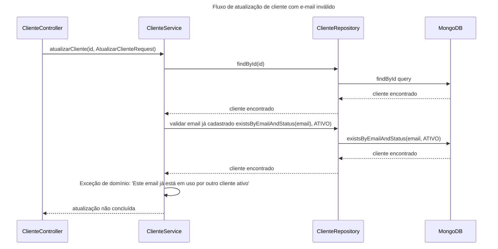

```mermaid
---
title: Fluxo de atualização de cliente com sucesso
---
sequenceDiagram
participant CC as ClienteController
participant CS as ClienteService
participant CR as ClienteRepository
participant M as MongoDB
participant ER as EventoRepository
participant AEP as ApplicationEventPublisher
participant K as KafkaEventPublisher
participant T as Kafka Topic

    CC->>CS: atualizarCliente(id, AtualizarClienteRequest)
    CS->>CR: findById(id)
    CR->>M: findById query
    M-->>CR: cliente encontrado
    CR-->>CS: cliente encontrado
    CS->>CS: validar status cliente
    CS->>CR: validar email já cadastrado existsByEmailAndStatus(email), ATIVO)
    CR->>M: existsByEmailAndStatus(email, ATIVO)
    M-->>CR: cliente não encontrado
    CR-->>CS: cliente não encontrado
    CS->>CS: atualziar cliente
    CS->>ER: publicar evento CLIENTE_ATUALIZADO
    ER->>AEP: publishEvent ClienteEvento
    AEP-->>K: Aguardar transação comitar pra publicar
    CS->>CR: salvar cliente
    CR->>M: salvar cliente
    M-->>CR: cliente salvo
    CR-->>CS: confirmada atualização
    CS-->>K: transação comitada
    K->>T: publicar ClienteEvento
    CS-->>CC: atualização concluída
```

```mermaid
---
title: Fluxo de atualização de cliente INATIVO
---
sequenceDiagram
participant CC as ClienteController
participant CS as ClienteService
participant CR as ClienteRepository
participant M as MongoDB

    CC->>CS: atualizarCliente(id, AtualizarClienteRequest)
    CS->>CR: findById(id)
    CR->>M: findById query
    M-->>CR: cliente encontrado
    CR-->>CS: cliente encontrado
    CS->>CS: validar status cliente
    CS->>CS: Exceção de domínio: 'Não é possível atualizar um cliente inativo'
    CS-->>CC: atualização não concluída
```

```mermaid
---
title: Fluxo de atualização de cliente com e-mail inválido
---
sequenceDiagram
    participant CC as ClienteController
    participant CS as ClienteService
    participant CR as ClienteRepository
    participant M as MongoDB

    CC->>CS: atualizarCliente(id, AtualizarClienteRequest)
    CS->>CR: findById(id)
    CR->>M: findById query
    M-->>CR: cliente encontrado
    CR-->>CS: cliente encontrado
    CS->>CR: validar email já cadastrado existsByEmailAndStatus(email), ATIVO)
    CR->>M: existsByEmailAndStatus(email, ATIVO)
    M-->>CR: cliente encontrado
    CR-->>CS: cliente encontrado
    CS->>CS: Exceção de domínio: 'Este email já está em uso por outro cliente ativo'
    CS-->>CC: atualização não concluída
```