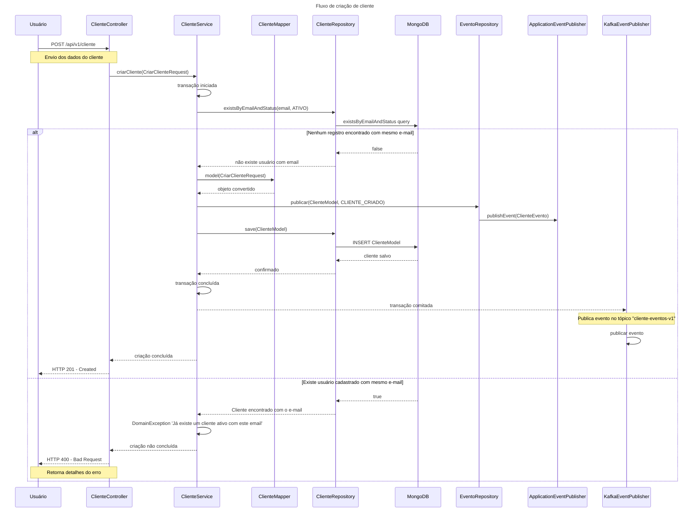

```mermaid
---
title: Fluxo de criação de cliente
---
sequenceDiagram
participant U as Usuário
participant CC as ClienteController
participant CS as ClienteService
participant CM as ClienteMapper
participant CR as ClienteRepository
participant M as MongoDB
participant ER as EventoRepository
participant AEP as ApplicationEventPublisher
participant K as KafkaEventPublisher

    U->>CC: POST /api/v1/cliente
    Note over U,CC: Envio dos dados do cliente
    
    CC->>CS: criarCliente(CriarClienteRequest)
    CS->>CS: transação iniciada
    CS->>CR: existsByEmailAndStatus(email, ATIVO)
    CR->>M: existsByEmailAndStatus query
    alt Nenhum registro encontrado com mesmo e-mail
        M-->>CR: false
        CR-->>CS: não existe usuário com email
        CS->>CM: model(CriarClienteRequest)
        CM-->>CS: objeto convertido
        CS->>ER: publicar(ClienteModel, CLIENTE_CRIADO)
        ER->>AEP: publishEvent(ClienteEvento)
        CS->>CR: save(ClienteModel)
        CR->>M: INSERT ClienteModel
        M-->>CR: cliente salvo
        CR-->>CS: confirmado
        CS->>CS: transação concluída
        CS-->>K: transação comitada
        Note over K: Publica evento no tópico "cliente-eventos-v1"
        K->>K: publicar evento
        CS-->>CC: criação concluída
        CC-->>U: HTTP 201 - Created
    else Existe usuário cadastrado com mesmo e-mail
        M-->>CR: true
        CR-->>CS: Cliente encontrado com o e-mail
        CS->>CS: DomainException 'Já existe um cliente ativo com este email'
        CS-->>CC: criação não concluída
        CC-->>U: HTTP 400 - Bad Request
        Note over CC,U: Retorna detalhes do erro
    end
```