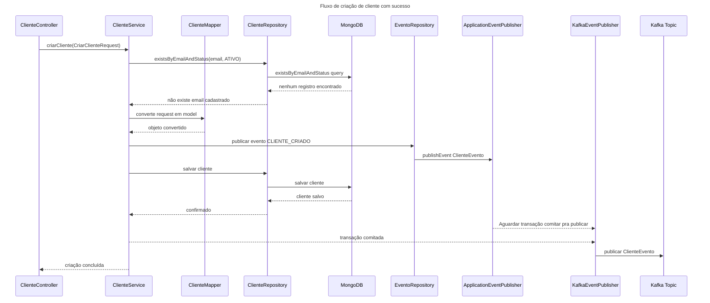
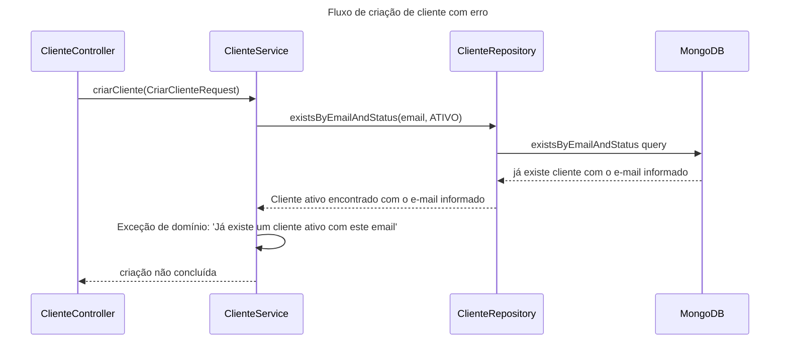

```mermaid
---
title: Fluxo de criação de cliente com sucesso
---
sequenceDiagram
participant CC as ClienteController
participant CS as ClienteService
participant CM as ClienteMapper
participant CR as ClienteRepository
participant M as MongoDB
participant ER as EventoRepository
participant AEP as ApplicationEventPublisher
participant K as KafkaEventPublisher
participant T as Kafka Topic

    CC->>CS: criarCliente(CriarClienteRequest)
    CS->>CR: existsByEmailAndStatus(email, ATIVO)
    CR->>M: existsByEmailAndStatus query
    M-->>CR: nenhum registro encontrado
    CR-->>CS: não existe email cadastrado
    CS->>CM: converte request em model
    CM-->>CS: objeto convertido
    CS->>ER: publicar evento CLIENTE_CRIADO
    ER->>AEP: publishEvent ClienteEvento
    CS->>CR: salvar cliente
    CR->>M: salvar cliente
    M-->>CR: cliente salvo
    CR-->>CS: confirmado
    AEP-->>K: Aguardar transação comitar pra publicar
    CS-->>K: transação comitada
    K->>T: publicar ClienteEvento
    CS-->>CC: criação concluída
```

```mermaid
---
title: Fluxo de criação de cliente com erro
---
sequenceDiagram
participant CC as ClienteController
participant CS as ClienteService
participant CR as ClienteRepository
participant M as MongoDB

    CC->>CS: criarCliente(CriarClienteRequest)
    CS->>CR: existsByEmailAndStatus(email, ATIVO)
    CR->>M: existsByEmailAndStatus query
    M-->>CR: já existe cliente com o e-mail informado
    CR-->>CS: Cliente ativo encontrado com o e-mail informado
    CS->>CS: Exceção de domínio: 'Já existe um cliente ativo com este email'
    CS-->>CC: criação não concluída
```