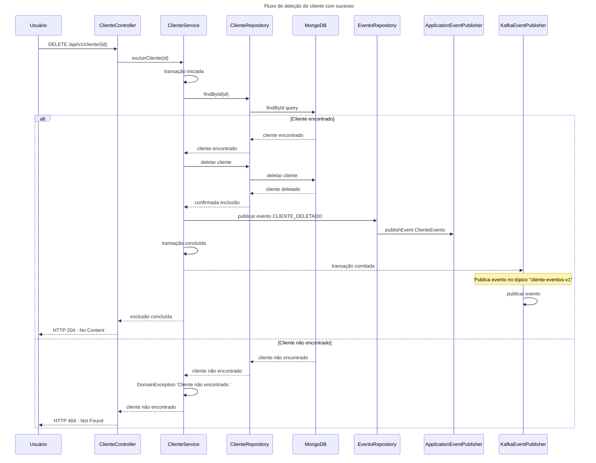

```mermaid
---
title: Fluxo de deleção de cliente com sucesso
---
sequenceDiagram
participant U as Usuário
participant CC as ClienteController
participant CS as ClienteService
participant CR as ClienteRepository
participant M as MongoDB
participant ER as EventoRepository
participant AEP as ApplicationEventPublisher
participant K as KafkaEventPublisher

    U->>CC: DELETE /api/v1/cliente/{id}
    CC->>CS: excluirCliente(id)
    CS->>CS: transação iniciada
    CS->>CR: findById(id)
    CR->>M: findById query
    alt Cliente encontrado
        M-->>CR: cliente encontrado
        CR-->>CS: cliente encontrado
        CS->>CR: deletar cliente
        CR->>M: deletar cliente
        M-->>CR: cliente deletado
        CR-->>CS: confirmada exclusão
        CS->>ER: publicar evento CLIENTE_DELETADO
        ER->>AEP: publishEvent ClienteEvento
        CS->>CS: transação concluída
        CS-->>K: transação comitada
        Note over K: Publica evento no tópico "cliente-eventos-v1"
        K->>K: publicar evento
        CS-->>CC: exclusão concluída
        CC-->>U: HTTP 204 - No Content
    else Cliente não encontrado
        M-->>CR: cliente não encontrado
        CR-->>CS: cliente não encontrado
        CS->>CS: DomainException 'Cliente não encontrado.'
        CS-->>CC: cliente não encontrado
        CC-->>U: HTTP 404 - Not Found
    end
```