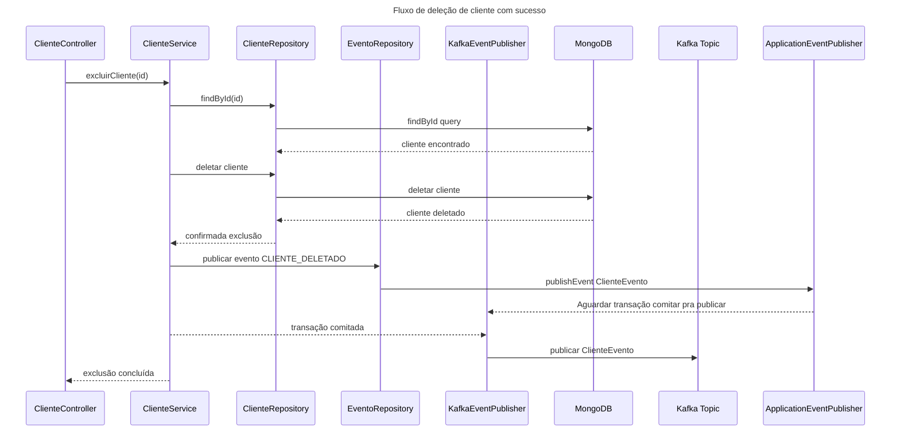
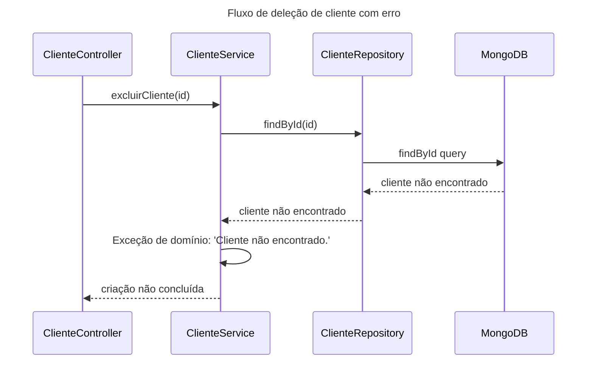

```mermaid
---
title: Fluxo de deleção de cliente com sucesso
---
sequenceDiagram
participant CC as ClienteController
participant CS as ClienteService
participant CR as ClienteRepository
participant ER as EventoRepository
participant K as KafkaEventPublisher
participant M as MongoDB
participant T as Kafka Topic
participant AEP as ApplicationEventPublisher

    CC->>CS: excluirCliente(id)
    CS->>CR: findById(id)
    CR->>M: findById query
    M-->>CR: cliente encontrado
    CS->>CR: deletar cliente
    CR->>M: deletar cliente
    M-->>CR: cliente deletado
    CR-->>CS: confirmada exclusão
    CS->>ER: publicar evento CLIENTE_DELETADO
    ER->>AEP: publishEvent ClienteEvento
    AEP-->>K: Aguardar transação comitar pra publicar
    CS-->>K: transação comitada
    K->>T: publicar ClienteEvento
    CS-->>CC: exclusão concluída
```

```mermaid
---
title: Fluxo de deleção de cliente com erro
---
sequenceDiagram
participant CC as ClienteController
participant CS as ClienteService
participant CR as ClienteRepository
participant M as MongoDB

    CC->>CS: excluirCliente(id)
    CS->>CR: findById(id)
    CR->>M: findById query
    M-->>CR: cliente não encontrado
    CR-->>CS: cliente não encontrado
    CS->>CS: Exceção de domínio: 'Cliente não encontrado.'
    CS-->>CC: criação não concluída
```