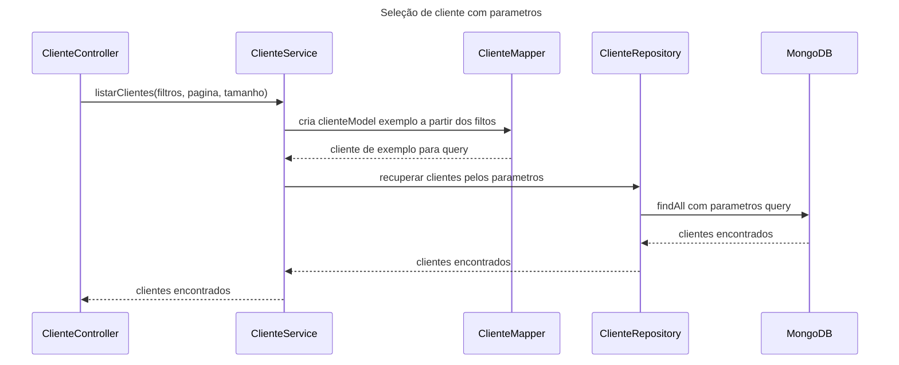
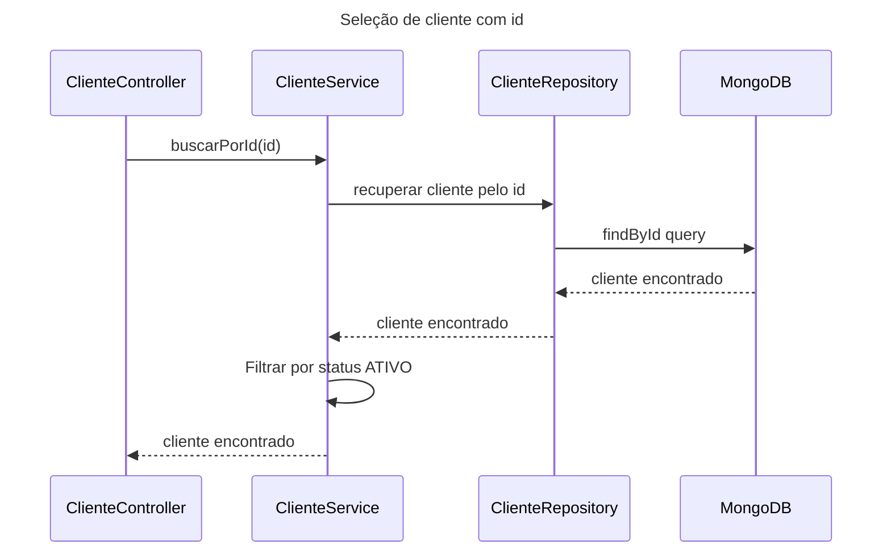
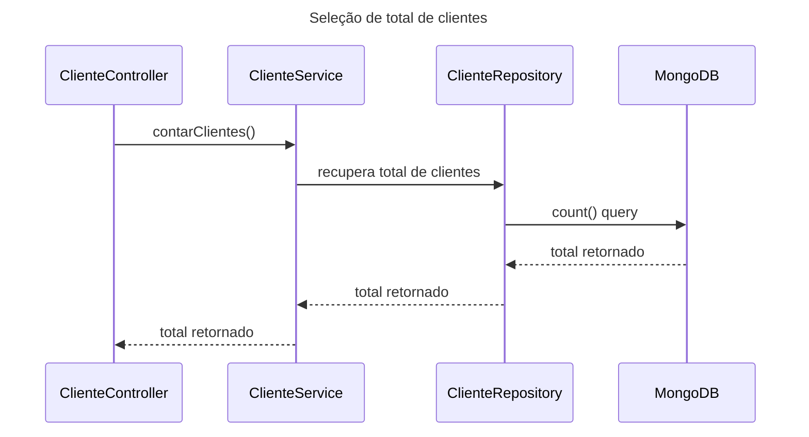

```mermaid
---
title: Seleção de cliente com parametros
---
sequenceDiagram
participant CC as ClienteController
participant CS as ClienteService
participant CM as ClienteMapper
participant CR as ClienteRepository
participant M as MongoDB

    CC->>CS: listarClientes(filtros, pagina, tamanho)
    CS->>CM: cria clienteModel exemplo a partir dos filtos
    CM-->>CS: cliente de exemplo para query
    CS->>CR: recuperar clientes pelos parametros
    CR->>M: findAll com parametros query
    M-->>CR: clientes encontrados
    CR-->>CS: clientes encontrados
    CS-->>CC: clientes encontrados
```

```mermaid
---
title: Seleção de cliente com id
---
sequenceDiagram
participant CC as ClienteController
participant CS as ClienteService
participant CR as ClienteRepository
participant M as MongoDB

    CC->>CS: buscarPorId(id)
    CS->>CR: recuperar cliente pelo id
    CR->>M: findById query
    M-->>CR: cliente encontrado
    CR-->>CS: cliente encontrado
    CS->>CS: Filtrar por status ATIVO
    CS-->>CC: cliente encontrado
```

```mermaid
---
title: Seleção de total de clientes
---
sequenceDiagram
participant CC as ClienteController
participant CS as ClienteService
participant CR as ClienteRepository
participant M as MongoDB

    CC->>CS: contarClientes()
    CS->>CR: recupera total de clientes
    CR->>M: count() query
    M-->>CR: total retornado
    CR-->>CS: total retornado
    CS-->>CC: total retornado
```