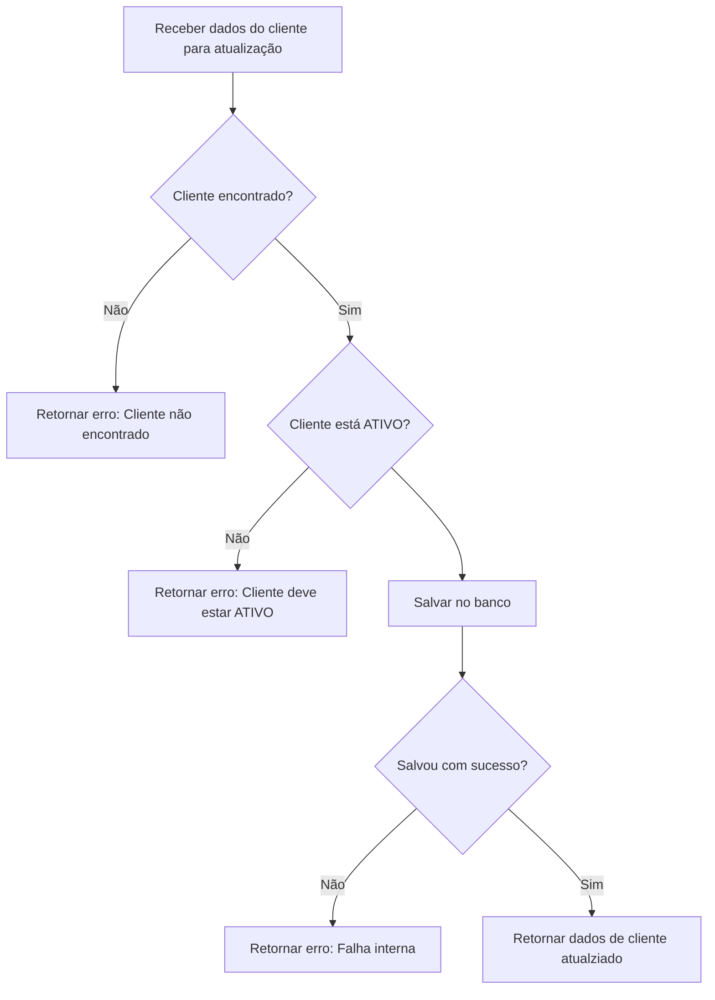

```mermaid
flowchart TD
    A[Receber dados do cliente para atualização] --> B{Cliente encontrado?}
    B -->|Não| C[Retornar erro: Cliente não encontrado]
    B -->|Sim| D{Cliente está ATIVO?}
    D -->|Não| E[Retornar erro: Cliente deve estar ATIVO]
    D --> F[Salvar no banco]
    F --> G{Salvou com sucesso?}
    G -->|Não| H[Retornar erro: Falha interna]
    G -->|Sim| J[Retornar dados de cliente atualziado]
```