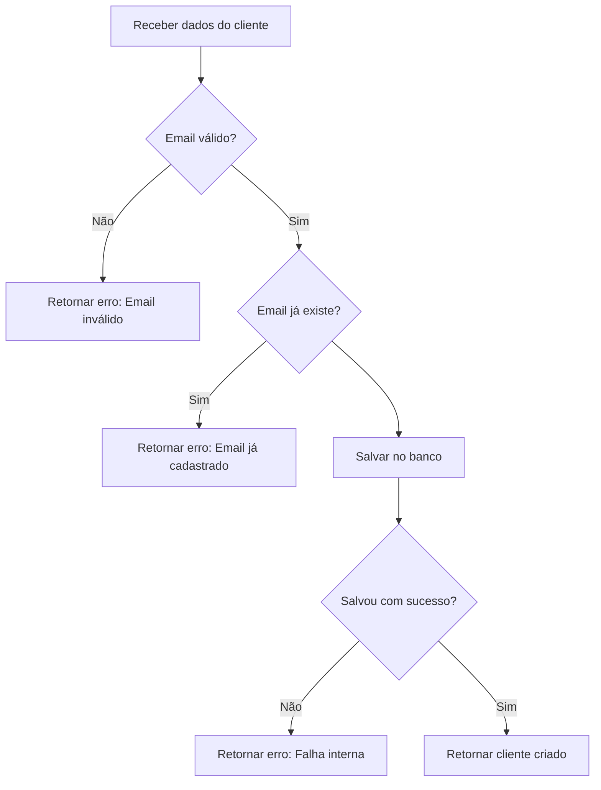

```mermaid
flowchart TD
    A[Receber dados do cliente] --> B{Email válido?}
    B -->|Não| C[Retornar erro: Email inválido]
    B -->|Sim| D{Email já existe?}
    D -->|Sim| E[Retornar erro: Email já cadastrado]
    D --> F[Salvar no banco]
    F --> G{Salvou com sucesso?}
    G -->|Não| H[Retornar erro: Falha interna]
    G -->|Sim| I[Retornar cliente criado]
```