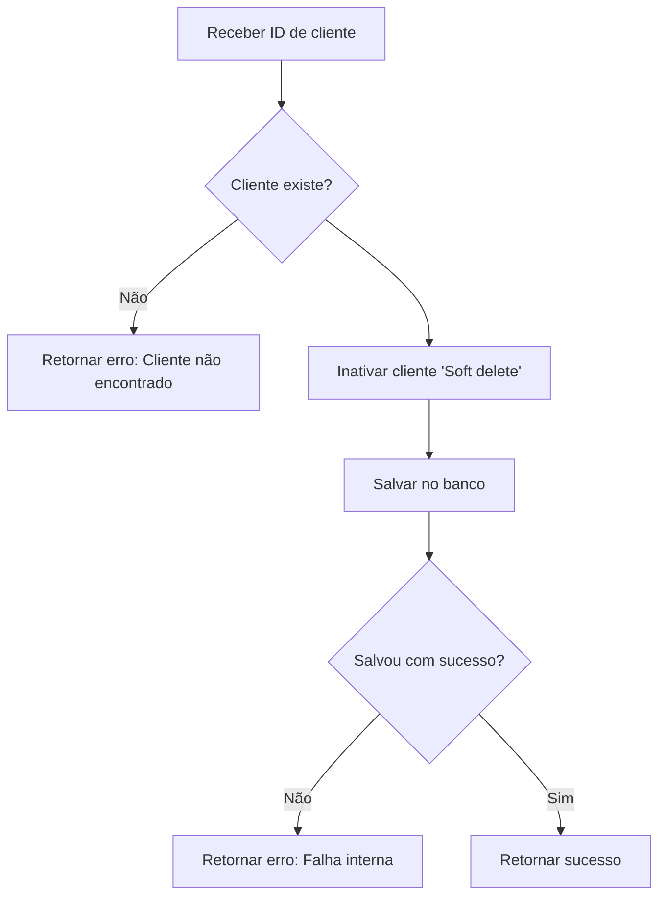

```mermaid
flowchart TD
    A[Receber ID de cliente] --> B{Cliente existe?}
    B -->|Não| C[Retornar erro: Cliente não encontrado]
    B --> D[Inativar cliente 'Soft delete']
    D --> E[Salvar no banco]
    E --> F{Salvou com sucesso?}
    F -->|Não| G[Retornar erro: Falha interna]
    F -->|Sim| H[Retornar sucesso]
```