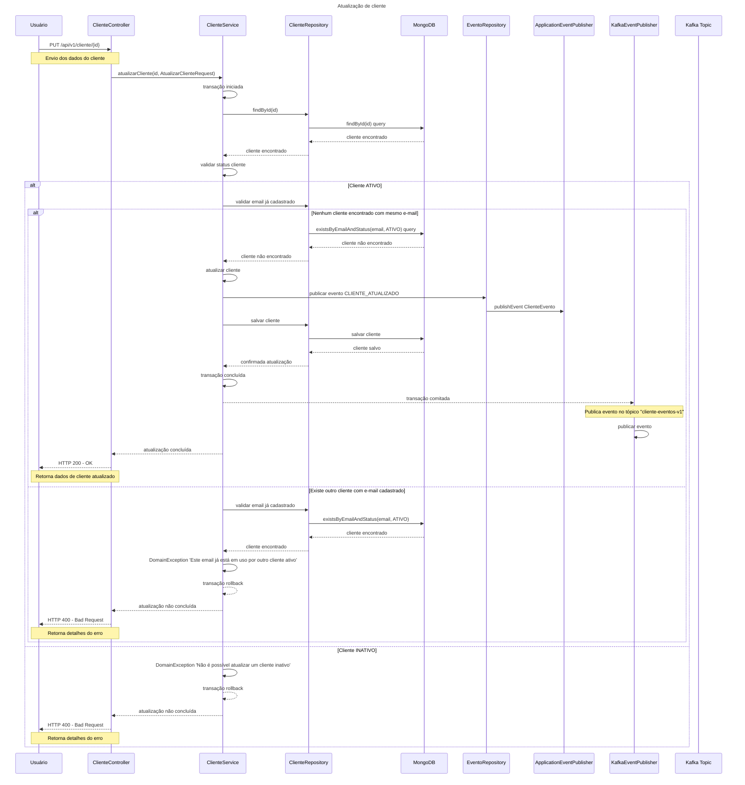

```mermaid
---
title: Atualização de cliente
---
sequenceDiagram
participant U as Usuário
participant CC as ClienteController
participant CS as ClienteService
participant CR as ClienteRepository
participant M as MongoDB
participant ER as EventoRepository
participant AEP as ApplicationEventPublisher
participant K as KafkaEventPublisher
participant T as Kafka Topic

    U->>CC: PUT /api/v1/cliente/{id}
    Note over U,CC: Envio dos dados do cliente
    CC->>CS: atualizarCliente(id, AtualizarClienteRequest)
    CS->>CS: transação iniciada
    CS->>CR: findById(id)
    CR->>M: findById(id) query
    M-->>CR: cliente encontrado
    CR-->>CS: cliente encontrado
    CS->>CS: validar status cliente
    alt Cliente ATIVO
        CS->>CR: validar email já cadastrado
        alt Nenhum cliente encontrado com mesmo e-mail
            CR->>M: existsByEmailAndStatus(email, ATIVO) query
            M-->>CR: cliente não encontrado
            CR-->>CS: cliente não encontrado
            CS->>CS: atualizar cliente
            CS->>ER: publicar evento CLIENTE_ATUALIZADO
            ER->>AEP: publishEvent ClienteEvento
            CS->>CR: salvar cliente
            CR->>M: salvar cliente
            M-->>CR: cliente salvo
            CR-->>CS: confirmada atualização
            CS->>CS: transação concluída
            CS-->>K: transação comitada
            Note over K: Publica evento no tópico "cliente-eventos-v1"
            K->>K: publicar evento
            CS-->>CC: atualização concluída
            CC-->>U: HTTP 200 - OK
            Note over CC,U: Retorna dados de cliente atualizado
        else Existe outro cliente com e-mail cadastrado
            CS->>CR: validar email já cadastrado
            CR->>M: existsByEmailAndStatus(email, ATIVO)
            M-->>CR: cliente encontrado
            CR-->>CS: cliente encontrado
            CS->>CS: DomainException 'Este email já está em uso por outro cliente ativo'
            CS-->>CS: transação rollback
            CS-->>CC: atualização não concluída
            CC-->>U: HTTP 400 - Bad Request
            Note over CC,U: Retorna detalhes do erro
        end
    else Cliente INATIVO
        CS->>CS: DomainException 'Não é possível atualizar um cliente inativo'
        CS-->>CS: transação rollback
        CS-->>CC: atualização não concluída
        CC-->>U: HTTP 400 - Bad Request
        Note over CC,U: Retorna detalhes do erro
    end
```