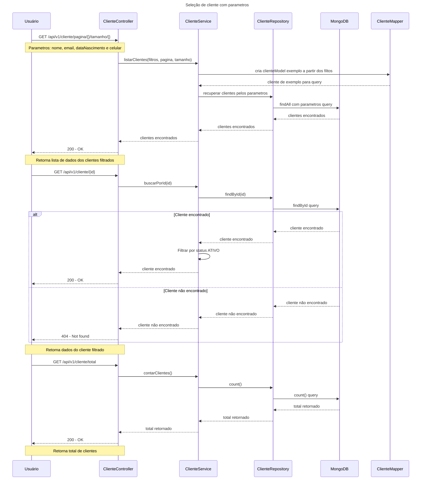

```mermaid
---
title: Seleção de cliente com parametros
---
sequenceDiagram
participant U as Usuário
participant CC as ClienteController
participant CS as ClienteService
participant CR as ClienteRepository
participant M as MongoDB
participant CM as ClienteMapper

    U->>CC: GET /api/v1/cliente/pagina/{}/tamanho/{}
    Note over U,CC: Parametros: nome, email, dataNascimento e celular
    CC->>CS: listarClientes(filtros, pagina, tamanho)
    CS->>CM: cria clienteModel exemplo a partir dos filtos
    CM-->>CS: cliente de exemplo para query
    CS->>CR: recuperar clientes pelos parametros
    CR->>M: findAll com parametros query
    M-->>CR: clientes encontrados
    CR-->>CS: clientes encontrados
    CS-->>CC: clientes encontrados
    CC-->>U: 200 - OK
    Note over CC,U: Retorna lista de dados dos clientes filtrados
    
    U->>CC: GET /api/v1/cliente/{id}
    CC->>CS: buscarPorId(id)
    CS->>CR: findById(id)
    CR->>M: findById query
    alt Cliente encontrado
        M-->>CR: cliente encontrado
        CR-->>CS: cliente encontrado
        CS->>CS: Filtrar por status ATIVO
        CS-->>CC: cliente encontrado
        CC-->>U: 200 - OK
    else Cliente não encontrado
        M-->>CR: cliente não encontrado
        CR-->>CS: cliente não encontrado
        CS-->>CC: cliente não encontrado
        CC-->>U: 404 - Not found
    end
    Note over CC,U: Retorna dados do cliente filtrado

    U->>CC: GET /api/v1/cliente/total
    CC->>CS: contarClientes()
    CS->>CR: count()
    CR->>M: count() query
    M-->>CR: total retornado
    CR-->>CS: total retornado
    CS-->>CC: total retornado
    CC-->>U: 200 - OK
    Note over CC,U: Retorna total de clientes
```